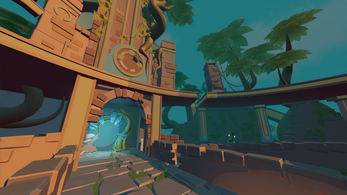
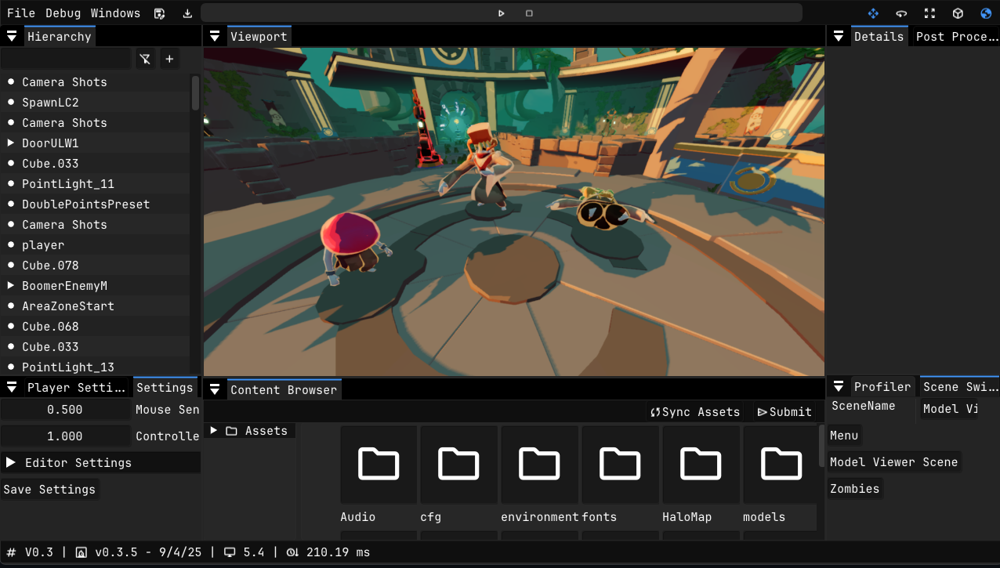
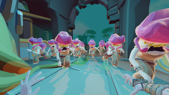

<figure>
    
</figure>

During my second year at BUas, I was assigned to make an FPS game using a custom engine that we have developed the eight weeks prior. Everything else was (concepting, production, releasing) was done in the eight weeks we were assigned to create this game. The team was based on the firefly team (the cross platform renderer, I made with my peers), the FPS team (the team we had to integrate our firefly renderer in). Some of our team members left the team and some people joined, making it a team of 12 people, including 3 artists. 
One issue we had, was that our team did not contain any designers. We had to improvise our design & production by assigning a programmer to the design side of the game, and assigning a programmer to the producer role. We picked those roles up, and maximized our end product.

### Custom Engine
As mentioned, we were not relying on a premade engine like Unreal that other students were using. We were using our own framework that was built using C++ and D3D12's shading language HLSL. Using our own engine gave us the full control of what the PC or console would do and we were not as limited as using a premade engine. The only thing we have to do, is make the necessary tools like a gizmo or scene serialization ourselves. Luckily, we had 8 active programmers (including me) that were actively working on making everything to our needs.

<figure>
    
</figure>

* **Renderer**

We carried over the firefly renderer that we used in our previous assignment. We were no longer bound to a generic requirement, where we had to support every style and every possible case. We also made the decision that we would change the style of our renderer from a deferred to a forward styled renderer. We were dealing with a lot of performance issues, which makes our game run slower than we actually want to. After talking with our artists on how many lights they were going to use, they agreed with the style change to favor speed. As I was the person responsible for the skeletal animation, I helped the team to make sure the skeletal animation worked as intended. That was not the only thing I did for the renderer. We were suffering from quite some draw calls per frame. So we settled for a simple approach to eliminate that. CPU sided view frustum culling.

* **Audio**

This game genre (FPS) relies heavily on audio. Spatial audio to be exact. The player needs to be aware of its surroundings and needs to be able to hear enemies approaching. I was responsible for the audio setup within the engine. I had to start from scratch, as the original implementation was not ideal in use and did not work on the PlayStation (which was our target platform with PC).

The main goal for the audio system was, have a system that controls everything. Timing of sounds, updating the player and emitter position, and the life management of the emitters. We only need to tell the system when we need to start playing the sound, what sound and how, giving us a very clean interface for the gameplay/UI programmers to work with. 

```cpp
bool LoadSound(const std::string_view name, uint32_t flags);
void RemoveSound(const std::string_view name);
void PlaySound(bee::Entity entity, bool isQueued = true);
void StopSound(bee::Entity entity);

void PlayAmbientSound(const std::string_view name);
void StopAmbientSound();
```
<figcaption><i>The audio system interface.</i></figcaption>
<br>

* **Animation**

This is another element we carried over from the firefly renderer. The skeletal animation system. All the animating was done on the CPU. The main reason for that was, because it was the simplest to do within our time frame. As it was not our most resource consuming system, we were fine with it as is. Luckily, there were some tricks we still had to increace performance quite a bit. One of those optimizations could have been multi-threaded traversal per skeleton. The skeletons are not depended on each other making it a nice and easy to implement optimization. 

Since we actually had to interact with the system and needed to change animations and animation states, we needed a nice interface (like the audio system) to make that happen, which looked like the following:

```cpp
void SetAnimation(bee::Entity entity, const std::string& animationName);
std::string GetAnimation(bee::Entity entity);

void SetAnimationSpeed(bee::Entity entity, float speed);
void StopAnimation(bee::Entity entity, bool reset);
void RepeatAnimation(bee::Entity entity, bool repeat);

std::string GetCurrentAnimationName(bee::Entity entity);
std::vector<std::string> GetAvailableAnimations(bee::Entity entity);
```

Since all the data was on the parent entity, I was able to create this simple, yet functional interface. 

<figure>
    
</figure>

### Release

[Check out Nakon and its trailer on itch.io](https://buas.itch.io/nakon)

Thanks to my wonderful team for the fun times and making this project possible. All the team members can be found on our itch.io page. Check them out aswell.